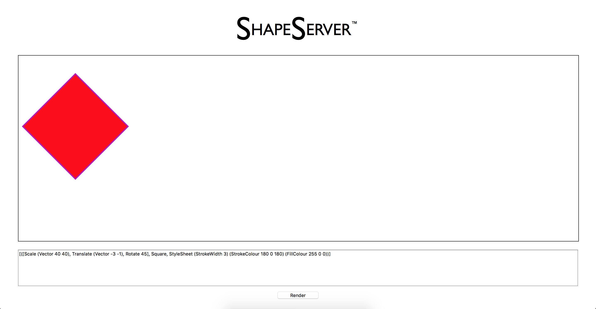
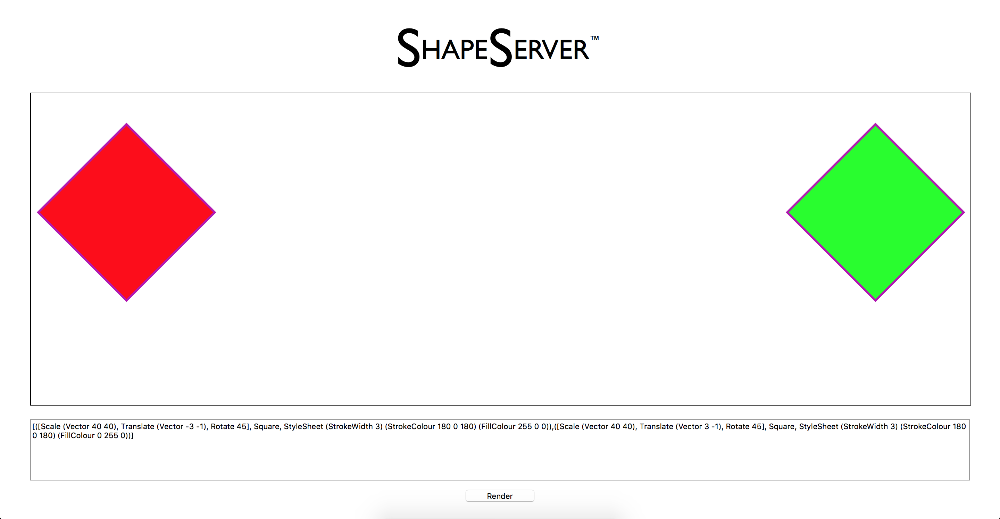

# ShapeServer
A haskell implementation of an SVG Shape Generation Server

# Installation
Download and install Stack by executing the command `curl -sSL https://get.haskellstack.org/ | sh`

After installing Stack do
<pre><code>git clone https://github.com/CalvinNolan/ShapeServer.git
cd ShapeServer
stack ghci
</code></pre>

After the project is compiled enter
<pre><code>main
</code></pre>
And go to the address localhost:3000 in your browser to see the ShapeServer running.

# Using the ShapeServer
The ShapeServer implements an embedded domain specific language to represent shapes which
is then interpreted through a seperate module to create SVGs, all of this is wrapped up in a web service to
provide user interaction and access to create SVGs through the shape language.

In the input box on the webpage it expects the same format as the shape language.
Overall it expects `[Drawing]` where `Drawing` is a triplet consisting of `([Transform], Shape, StyleSheet)`, the next sections will explain the possibilities for each of these three types. 
# Transform
A `Transform` can be many things such as `Identity`, `Translate (Vector Double Double)`, `Scale (Vector Double Double)` and `Rotate Double`.
  
`Identity` does nothing to the shape.
  
`Translate (Vector Double Double)` moves the shape along the X axis by the first double and along the Y axis by the second double e.g. `Translate (Vector 1 1)` will move a shape down and right by one unit along each axis.
  
`Scale (Vector Double Double)` increases the size of the shape along the X axis by the first double and along the Y axis by the second double e.g. `Scale (Vector 2 2)` will double the size of a shape. 
It is good to note that entering unqueal values for the two doubles allows you to skew your shape in each axis.
  
`Rotate Double` will rotate the shape about it's origin in degrees by the double specified e.g. `Rotate 45` will rotate a shape 45 degrees clockwise.

# Shape
A `Shape` is quite simply either a `Square` or a `Circle` and they work exactly as you would expect.

# StyleSheet
A `StyleSheet` allows you alter the look of a shape. A `StyleSheet` is broken into 
  `StyleSheet StrokeWidth StrokeColour FillColour`. 
  
`StrokeWidth` takes the form `StrokeWidth Double` and is used to specify the border size surrounding a shape e.g. `StrokeWidth 2` sets a stroke width of size 2 on a shape. Setting it to 0 ensures there is no border.
  
`StrokeColour` takes the form `StrokeColour Integer Integer Integer` where the three colours represent Red, Green and Blue in that order and the style is the the colour of the border on the shape. It follows the usual RGB conventions where 0 represents the darkest shade and 255 (the maximum) represents the brightest shade e.g.
`StrokeColour 255 0 0` sets the border's colour to pure red.
  
`FillColour` also takes the form `FillColour Integer Integer Integer` where the three colours represent Red, Green and Blue in that order and the style is the colour of the shape. It follows the usual RGB conventions where 0 represents the darkest shade and 255 (the maximum) represents the brightest shade e.g.
`FillColour 0 255 0` sets the shape's colour to pure green.
  
An example of a complete `StyleSheet` in this language that is a red shape with a small blue border is `StyleSheet (StrokeWidth 1) (StrokeColour 0 0 255) (FillColour 255 0 0)`.

# Examples
Here is a complete example of how to create a large red square with a small purple border rotated by 45 degrees and moved to the left of the screen:
`[([Scale (Vector 40 40), Translate (Vector -3 -1), Rotate 45], Square, StyleSheet (StrokeWidth 3) (StrokeColour 180 0 180) (FillColour 255 0 0))]`.
  
Here's what it looks like:

  
Multiple shapes can be drawn by simply placing them one after the other and comma seperating them in the input.
Here's an example of two squares drawn on opposite ends of the screen. `[([Scale (Vector 40 40), Translate (Vector -3 -1), Rotate 45], Square, StyleSheet (StrokeWidth 3) (StrokeColour 180 0 180) (FillColour 255 0 0)),([Scale (Vector 40 40), Translate (Vector 3 -1), Rotate 45], Square, StyleSheet (StrokeWidth 3) (StrokeColour 180 0 180) (FillColour 0 255 0))]`.
  
Here's what it looks like:

If an input is not of the right syntax, a big "Invalid Input!" message will appear across the SVG until a correct syntax is rendered.
